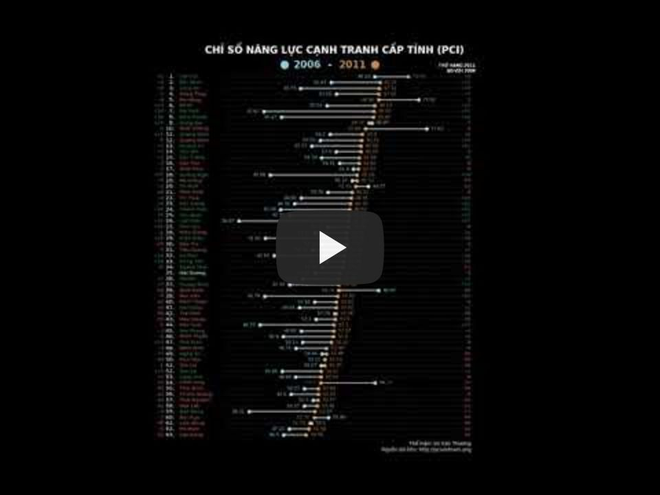

# CHỈ SỐ NĂNG LỰC CẠNH TRANH CẤP TỈNH - PCI

Video trình bày sự thay đổi của chỉ số năng lực cạnh tranh các tỉnh thành tại Việt Nam từ 2006 - 2018.  
Dữ liệu được lấy từ và xử lý bằng thư viện Pandas, các biểu đồ được dựng bằng Matplotlib và kết nối thành video bằng OpenCV.  
Nguồn dữ liệu: [http://pcivietnam.org](http://pcivietnam.org)
  
  
